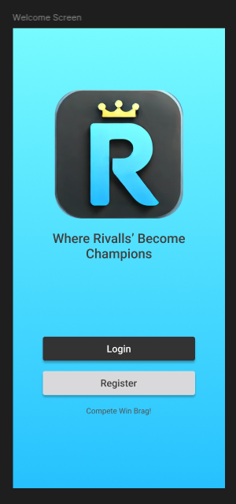
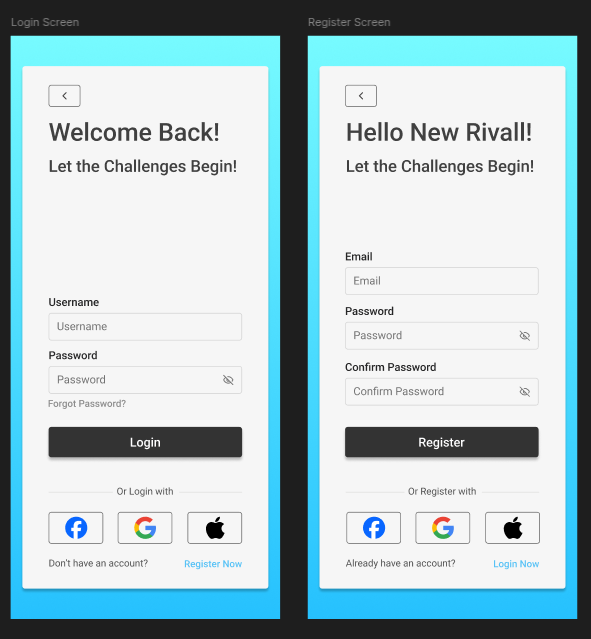
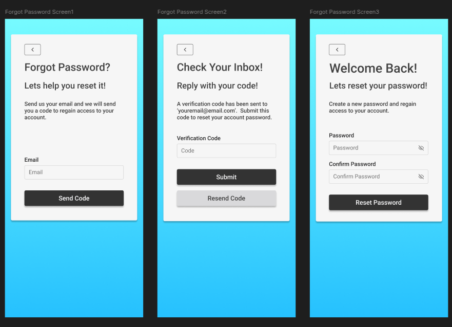
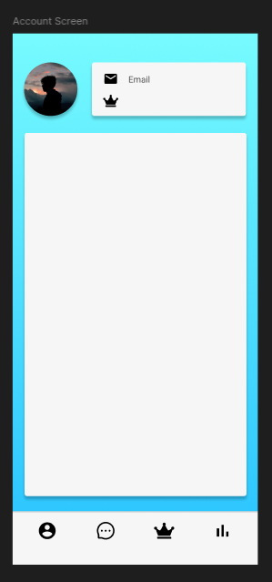
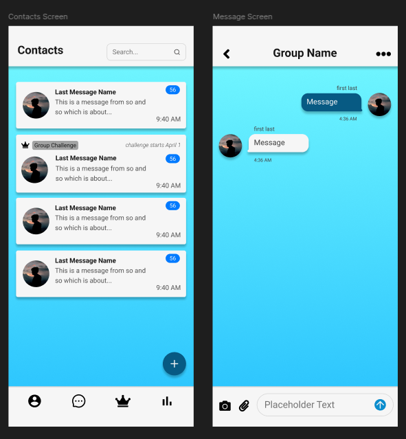

# Rivall Project  

This repository contains the complete codebase for the Rivall mobile application, a platform designed to foster competition, collaboration, and connection among users. The project is divided into two main components: the **Rivall Frontend** and the **Rivall Backend**.  

---

## About the App  

Rivall is a mobile application that allows users to compete in challenges, track their progress, and connect with others. The app provides features such as secure user authentication, real-time messaging, QR code integration, and dynamic UI components.  

## Development / Future Work

**This project is not finished.**  Current TODO's include completeing the following features:
- Debugging live messaging between users.
- Allow users to create groups pulling from their contacts list.
- Allow users to chat within their group about challenges.
- Allow users to create challenges that all users within the group can vote on.
- Allow users to update their progress on a group challenge, send live updates of progess to all group members.
- Allow users to finish a challenge and vote on the winner as well as the challenge.
- Help users find and create challenges baised on successful challenges from other groups.
- Support styles for IOS users (Currently, this app is only styled for Android)
- Deploy the backend to a hosting service.
- Setup the backend hosting service to send emails to users (Useful for recovering user accounts).
- Complete a CI/CD pipeline to streamline development.
- Publish the app on the Google Play Store and Apple App Store.

### Key Features  
- **User Authentication**: Secure login and registration flows.  
- **Dynamic UI**: Components styled using Tailwind CSS and Gluestack UI.  
- **Account Sharing Via QR Code**: Users can scan or generate QR codes for seamless interactions.  
- **Real-Time Direct Messaging**: Leveraging WebSockets for live chat and notifications.  

---

## Project Structure  

### Rivall Frontend  
The frontend is built with React Native and Expo, ensuring compatibility with Android and future compatibility with iOS. It handles the user interface, user interactions, and communication with the backend.  

#### Key Libraries and Tools  
- **Expo Router**: For managing navigation and routing.  
- **React Query**: For efficient data fetching and caching.  
- **Tailwind CSS**: For utility-first styling.  
- **Gluestack UI**: For reusable and customizable UI components.  

## Material Design Principles  

The Rivall frontend adheres to Google's Material Design principles to ensure a consistent and intuitive user experience. Key aspects include:  
- **Typography**: Clear and legible fonts with appropriate hierarchy.  
- **Color Palette**: A well-defined color scheme for primary, secondary, and background elements, ensuring accessibility and visual harmony.  
- **Elevation and Shadows**: Components like cards and buttons use shadows to convey depth and hierarchy.  
- **Responsive Layouts**: The app adapts to various screen sizes and orientations.  
- **Interactive Feedback**: Buttons and other interactive elements provide visual feedback on hover, press, and focus states.  

### Rivall Backend  
The backend is built with Go and provides REST APIs and WebSocket connections for the frontend. It handles user authentication, data storage, and real-time communication.  

#### Key Features  
- **Authentication**: Secure JWT-based authentication.  
- **Database**: MongoDB Atlas for data storage.  
- **WebSocket Support**: Real-time messaging and notifications.  
- **Scalable Architecture**: Designed for high performance and reliability.  

#### Available API Routes  

[More route information is avalible via this project's Postman workspace.](https://www.postman.com/material-geoscientist-57114344/rivall-dev/overview)

The Rivall Backend API provides the following resources:

- **Public Routes**:  
- **POST /api/v1/auth/register**: Register a new user.
- **POST /api/v1/auth/login**: Log in an existing user.
- **POST /api/v1/auth/recovery/send-code**: Send an account recovery email.
- **POST /api/v1/auth/recovery/validate-code**: Validate an account recovery code.
- **GET /api/v1/contacts/{user_id}**: Retrieve a user's contacts.

- **Private Routes**:  
- **GET /api/v1/users/{user_id}**: Retrieve user details.
- **PUT /api/v1/auth/recovery/{user_id}/reset-password**: Reset a user's password.
- **POST /api/v1/auth/{user_id}/refresh**: Renew an access token.
- **DELETE /api/v1/auth/{user_id}/logout**: Log out a user.
- **POST /api/v1/users/{user_id}/contacts**: Add a new contact for a user.
- **GET /api/v1/users/{user_id}/contacts/{chat_id}/chat**: Retrieve a chat for a specific contact.
- **GET /api/v1/ws/connect/{user_id}?Authorization={Access_Token}**: Establish a WebSocket connection.

---

## Wireframes  
[Wireframes and designs for the front end were first designed in Figma.](https://www.figma.com/design/t3P3bmJtwAenuBDGILSyPH/Rivall-Screens?node-id=0-1&t=SKrGN76y7KhwlMHG-1)

### Homescreen  
  

### Auth Screens  
  

### Account Recovery  
  

### Account Screen  
  

### Messaging  
  

---

## Getting Started  

### Prerequisites  
- Node.js and npm installed.  
- Expo CLI installed globally.  
- Go installed (for backend development).  

### Installation  

1. Clone the repository:  
        ```bash  
        git clone https://github.com/Nathaniel-Reeves/Rivall.git
        cd Rivall  
        ```  

2. Set up the backend:  
        - Navigate to the backend directory:  
            ```bash  
            cd Rivall-Backend  
            ```  
        - Create a `.env` file with the following variables:  
            ```env  
            MONGO_URI=<your-mongodb-atlas-uri>  
            JWT_SECRET=<your-jwt-secret>  
            ```  
        - Install dependencies and run the backend:  
            ```bash  
            go mod download  
            go run main.go  
            ```  

3. Set up the frontend:  
        - Navigate to the frontend directory:  
            ```bash  
            cd Rivall-Frontend  
            ```  
        - Install dependencies:  
            ```bash  
            npm install  
            ```  
        - Start the development server:  
            ```bash  
            npm run start  
            ```  

4. Use the Expo Go app to scan the QR code and run the app on your device.  

---

## Contributing  

Contributions are welcome! Please fork the repository and submit a pull request with your changes.  

---

## License  

This project is licensed under the MIT License.  
