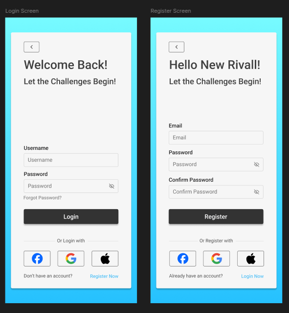
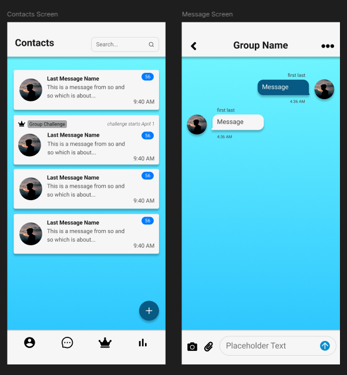

# Rivall Frontend  

This repository contains the frontend code for the Rivall mobile application, a platform designed to foster competition, collaboration, and connection among users. The frontend is built using modern web and mobile development technologies, ensuring a seamless and responsive user experience.  

## About the App  

Rivall is a mobile application that allows users to compete in challenges, track their progress, and connect with others. The frontend is responsible for rendering the user interface, handling user interactions, and communicating with the backend to fetch and update data.  

### Key Features  
- **User Authentication**: Secure login and registration flows.  
- **Dynamic UI**: Components styled using Tailwind CSS and Gluestack UI.  
- **Account Sharing Via QR Code**: Users can scan or generate QR codes for seamless interactions.  
- **Real-Time Direct Messaging**: Leveraging WebSockets for live chat and notifications.  

## How It Works  

The frontend is built with React Native and Expo, making it compatible with both Android and iOS platforms. Key libraries and tools include:  
- **Expo Router**: For managing navigation and routing.  
- **React Query**: For efficient data fetching and caching.  
- **Tailwind CSS**: For utility-first styling.  
- **Gluestack UI**: For reusable and customizable UI components.  

The app communicates with the backend via REST APIs and WebSocket connections to fetch user data, handle authentication, and enable real-time features.  

## Material Design Principles  

The Rivall frontend adheres to Google's Material Design principles to ensure a consistent and intuitive user experience. Key aspects include:  
- **Typography**: Clear and legible fonts with appropriate hierarchy.  
- **Color Palette**: A well-defined color scheme for primary, secondary, and background elements, ensuring accessibility and visual harmony.  
- **Elevation and Shadows**: Components like cards and buttons use shadows to convey depth and hierarchy.  
- **Responsive Layouts**: The app adapts to various screen sizes and orientations.  
- **Interactive Feedback**: Buttons and other interactive elements provide visual feedback on hover, press, and focus states.  

## Wireframes

[Wireframes and designs for the front end were first designed in Figma.](https://www.figma.com/design/t3P3bmJtwAenuBDGILSyPH/Rivall-Screens?node-id=0-1&t=SKrGN76y7KhwlMHG-1)

## Wireframes  

### Homescreen  
  

### Auth Screens  
  

### Account Recovery  
  

### Account Screen  
  

### Messaging  
  

## Getting Started  

### Prerequisites  
- Node.js and npm installed.  
- Expo CLI installed globally.  

### Installation  
1. Clone the repository:  
    ```bash  
    git clone https://github.com/nathaniel/Rivall.git  
    cd Rivall/Rivall-Frontend  
    ```  
2. Install dependencies:  
    ```bash  
    npm install  /e
    ```  

### Running the App  
- Start the development server:  
  ```bash  
  npm run start  
  ```  
- Use the Expo Go app to scan the QR code and run the app on your device.  

## Contributing  

Contributions are welcome! Please fork the repository and submit a pull request with your changes.  

## License  

This project is licensed under the Apache License V2.0.  
